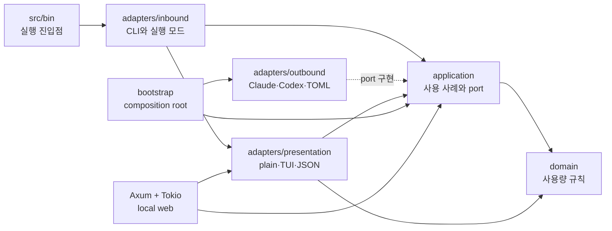
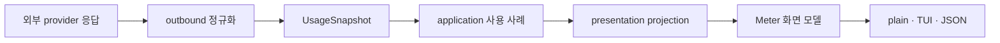

# agentmeter

코딩 에이전트의 사용 한도를 같은 형식으로 보여주는 CLI 모음입니다.

- **`agentmeter`** — 설정한 에이전트들을 한 화면에 나란히
- **`ccmeter`** — Claude Code 만
- **`codexmeter`** — Codex 만

각 도구의 `/usage`·`/status` 가 보여주는 것과 같은 값 — 한도 소진율과 리셋 시각 — 을
터미널에서 바로 확인하거나 상주시켜 둘 수 있습니다.

```
$ ccmeter
› Current session
  ██████████████████████████████████████░░░░░░░░░░  79% used
  ███████████████████████████████████████████████░  0 hour 4 minutes left
  Resets Aug 18 at 9:30pm (Asia/Seoul)

  Current week (all models)
  ███████████████████████████░░░░░░░░░░░░░░░░░░░░░  57% used
  ███████████████████████████████████████████████░  0 day 3 hour 34 minutes left
  Resets Aug 19 at 1:00am (Asia/Seoul)

  기준 21:23 (1분 전, 로컬 캐시)

$ codexmeter
  Current week (all models)
  ████████████████████████░░░░░░░░░░░░░░░░░░░░░░░░  50% used
  █████████████████████████████████████░░░░░░░░░░░  1 day 15 hour 5 minutes left
  Resets Aug 20 at 12:31pm (Asia/Seoul)

  기준 21:25 (방금, 직접 조회)
```

두 도구는 같은 옵션, 같은 게이지, 같은 문구를 씁니다.
리셋 시각은 오늘이든 아니든 항상 날짜를 붙입니다 — 시각만 있으면 화면만 보고
오늘인지 내일인지 알 수 없습니다.
Codex 의 `/status` 는 남은 비율(`71% left`)로 표시하지만, 여기서는 ccmeter 와 맞춰
**소진율**(`29% used`)로 통일했습니다. `›` 는 지금 적용 중인 한도 표시입니다.

게이지는 두 줄입니다. 위는 한도를 얼마나 썼는지, 아래는 그 창(세션 5시간 / 주간 7일)의
시간이 얼마나 흘렀는지입니다. 둘을 견주면 페이스가 읽힙니다 — 위 예시는 시간이 95% 지났는데
79% 만 썼으니 여유가 있습니다. 반대로 시간 게이지가 더 짧으면 이번 창은 일찍 소진됩니다.

마지막 줄은 그 숫자가 **언제 기준인지** 밝힙니다. ccmeter 는 로컬 캐시를 읽을 수 있어서
방금 조회한 값인지 몇 분 전 값인지 구분되어야 합니다.

## 사용법

### agentmeter — 여러 에이전트를 한 화면에

```bash
agentmeter                              # 설정한 에이전트를 모두 조회
agentmeter -w                           # 상주 모드 (좌우 분할)
agentmeter --json                        # 에이전트별 키를 가진 JSON

agentmeter config list                   # 설정 보기
agentmeter config get agents             # 값 하나 보기
agentmeter config set agents=claude,codex   # 표시할 에이전트 지정
```

구획은 **좌우로** 놓입니다 (`A | B`). 터미널이 좁으면(100칸 미만) 1회 출력에서는
세로로 쌓습니다 — 폭 40짜리 게이지 두 개보다 폭 80짜리 하나가 읽기 쉽습니다.

에이전트 하나가 실패해도 나머지는 그대로 보여주고, 조회는 **동시에** 합니다.

설정은 `~/.config/agentmeter/config.toml` 에 저장됩니다
(`XDG_CONFIG_HOME` 을 존중합니다).

```toml
agents = ["claude", "codex"]
```

순서가 화면 순서입니다. 파일이 없으면 등록된 에이전트를 모두 보여줍니다.
모르는 이름을 넣으면 **저장하기 전에** 거절합니다.

### ccmeter / codexmeter — 한 에이전트만

```bash
ccmeter                    # 한 번 출력하고 종료
ccmeter -w                 # 상주 모드 (전체 화면, 60초마다 갱신)
ccmeter -n 120             # 120초 주기로 상주
ccmeter --json             # statusline·스크립트용
ccmeter --live             # 캐시를 건너뛰고 직접 조회 (ccmeter 전용)
watch -n 60 ccmeter        # watch 와 함께 써도 됩니다
```

`codexmeter` 도 옵션이 완전히 같습니다.
상주 모드에서 `r`은 캐시 우선 즉시 새로고침, `R`은 Claude 캐시와 백오프를
건너뛴 HTTP 직접 조회, `q`는 종료입니다. 직접 조회가 실패하면 직전 값과 실제 오류를
함께 표시합니다.

상주 모드는 조회할 때마다 사용률을 분 단위로 기록해 3행 Sparkline으로 보여줍니다.

```
 › Current session  +3%p
   ██████████████████████████░░░░░░░░  62% used
   ████████████████████████████████░░  0 hour 24 minutes left
   ·····························▅▅▆··
   Resets Aug 18 at 9:30pm (Asia/Seoul)
```

가로축은 창 전체(세션 5시간 / 주간 7일)라 바로 위 시간 게이지와 축이 같고,
수집하지 않은 구간은 `·` placeholder로 비어 있습니다. 제목 옆 `+3%p`는 현재 창의
첫 표본 이후 늘어난 양입니다. 실측 표본은 `~/.cache/agentmeter/history/` 아래의
공급자·창별 JSON에 저장되며, 재실행해도 같은 5시간/7일 창의 기록을 복원합니다.

출력이 터미널이 아니면(파이프, `watch` 아래) 자동으로 1회 출력으로 내려갑니다.
전체 화면 TUI 는 alternate screen 을 쓰기 때문에 `watch` 안에서는 동작할 수 없습니다.

### 웹 대시보드

```bash
agentmeter web                  # 캐시 우선, 기본 60초 갱신
agentmeter web --live           # 매 주기 직접 조회
agentmeter web --interval 120   # 120초마다 갱신
agentmeter web --port 8080      # 127.0.0.1:8080 고정 포트
agentmeter web --host 0.0.0.0   # 모든 IPv4 인터페이스에 바인딩
```

기본적으로 `127.0.0.1`과 운영체제가 고른 ephemeral port를 사용하고 실제 주소를
출력합니다. 예: `agentmeter web: http://127.0.0.1:54321`. `--port`로 포트를,
`--host`로 바인딩 IP를 지정할 수 있습니다. `--host 0.0.0.0`은 인증과 TLS가 없는
대시보드를 네트워크에 노출할 수 있으므로 신뢰할 수 있는 네트워크에서만 사용하세요.
설정 파일의
`agents` 순서를 그대로 사용하며, 한 agent면 한 pane, 두 agent면 좌우 두 pane으로
표시합니다. 좁은 브라우저에서는 pane을 세로로 쌓습니다.

사용량은 bar chart, 현재 5시간/7일 창의 영속 히스토리는 area chart로 표시합니다.
브라우저의 `Refresh`는 캐시 우선, `Live HTTP`는 Claude 캐시와 백오프를 건너뛰는
직접 조회입니다. HTML/CSS/JavaScript는 바이너리에 포함되어 외부 CDN이 필요 없습니다.

자세한 내용은 [docs/web-dashboard.md](docs/web-dashboard.md)를 보세요.

## 동작 방식

### ccmeter

**로컬 캐시를 먼저 읽습니다.** Claude Code의
`~/.claude/token-scope-oauth-usage.json`과 마지막 직접 조회 성공 값을 보존한
`~/.cache/agentmeter/claude-usage.json` 중 최신 값을 사용합니다. 네트워크 호출이
없어 즉시 응답하고 `HTTP 429`도 없습니다.

캐시가 15분보다 오래됐을 때만 `GET /api/oauth/usage` 를 직접 호출합니다.
조회에 실패하면 5분간 다시 시도하지 않고, 그동안은 캐시 값에 `갱신 실패` 를 붙여
보여줍니다. `--live` 는 캐시를 건너뛰고 항상 직접 조회합니다.

직접 조회할 때 자격증명은 macOS Keychain(`Claude Code-credentials`), 없으면
`~/.claude/.credentials.json` 에서 **읽기만** 합니다.
토큰 갱신은 일부러 하지 않습니다 — 리프레시 토큰은 회전(rotation)하므로 이 도구가 갱신해
저장하면 Claude Code 본체의 세션을 무효화할 수 있습니다. 대신 조회할 때마다 자격증명을 다시
읽어서, Claude Code 가 갱신해 둔 새 토큰을 자연스럽게 따라갑니다.
만료되면 `claude` 를 한 번 실행하면 됩니다.

자세한 내용은 [docs/ccmeter.md](docs/ccmeter.md) 를 보세요.

### codexmeter

`codex app-server` 를 자식 프로세스로 띄우고 `account/rateLimits/read` 를 호출합니다.
HTTP 엔드포인트를 직접 두드리지 않으므로 토큰 관리·갱신은 전부 Codex 가 처리합니다.
`CODEX_BIN` 으로 실행 파일 경로를 바꿀 수 있습니다.

프로토콜과 응답 타입은 Codex 가 스스로 내보내는 스키마를 따릅니다:

```bash
codex app-server generate-json-schema --out ./schema
# GetAccountRateLimitsResponse, RateLimitSnapshot, RateLimitWindow
```

`rateLimitsByLimitId`(다중 버킷)가 있으면 그쪽을 쓰고, 없을 때만 하위호환용
`rateLimits` 단일 뷰로 내려갑니다. 둘을 함께 쓰면 기본 한도가 두 번 나옵니다.
주간 창만 보여주며, 호출이 저렴해 캐시 계층 없이 매번 직접 조회합니다.

자세한 내용은 [docs/codexmeter.md](docs/codexmeter.md) 를 보세요.

### 로컬 로그를 쓰지 않는 이유

두 도구 모두 로컬 로그(`~/.claude/projects/**/*.jsonl` 등)를 집계하지 **않습니다.**
로컬 로그에는 그 기기에서 쓴 기록만 남지만 한도는 계정 단위로 합산되므로,
다른 컴퓨터나 웹에서 쓴 양이 빠져 항상 실제보다 낮게 나옵니다.
서버가 판정한 값을 그대로 받아오는 편이 정확합니다.

### 갱신 주기

상주 모드의 갱신 주기는 최소 30초입니다(기본 60초). 데이터 자체가 그보다 자주 변하지 않습니다.

`/api/oauth/usage` 자체에도 한도가 있어 자주 부르면 `HTTP 429` 가 돌아옵니다.
ccmeter 가 캐시를 먼저 읽는 것도 이 때문입니다 — 기본 경로에서는 네트워크를 쓰지 않습니다.
서버가 `Retry-After` 를 주면 그 값을 그대로 안내하지만, 실제로는 `retry-after: 0` 을
주면서 계속 막는 경우가 있어 0 은 "값 없음"으로 취급합니다.
상주 모드는 다음 주기에 자연히 회복되므로 따로 할 일이 없습니다.

## 주의

- ccmeter 가 쓰는 `/api/oauth/usage` 는 **공개 문서가 없는 내부 엔드포인트**입니다.
  Anthropic 이 언제든 응답 형태를 바꾸거나 없앨 수 있습니다.
- codexmeter 가 쓰는 app-server 는 Codex 가 `[experimental]` 로 표시한 인터페이스입니다.

그래서 양쪽 모두 개별 필드를 하드코딩하지 않고, 서버가 정규화해 둔 목록
(`limits` / `rateLimitsByLimitId`)을 순회합니다. 항목이 늘거나 처음 보는 종류가 와도
그대로 표시되며 죽지 않습니다.

## 문서

- [docs/architecture.md](docs/architecture.md) — 계층 경계, 도메인·화면 모델, 실행 모드
- [docs/architecture-review.html](docs/architecture-review.html) — 헥사고날 아키텍처 전체 리뷰
- [docs/ccmeter.md](docs/ccmeter.md) — 캐시 우선 조회, 자격증명, 429 대응
- [docs/codexmeter.md](docs/codexmeter.md) — app-server 프로토콜, 응답 처리
- [docs/web-dashboard.md](docs/web-dashboard.md) — 로컬 서버, 갱신 흐름, JSON projection

## 아키텍처

헥사고날 아키텍처를 사용하며 의존성은 바깥에서 안쪽으로만 향합니다. 안쪽 module은
CLI, HTTP, 파일시스템, 프로세스, 터미널 framework를 알지 못합니다.



| 위치 | 책임 | 알면 안 되는 것 |
|---|---|---|
| `src/domain/` | `UsageLimit`, `UsageSnapshot`, `Origin`, 시간 창과 순수 규칙 | provider 응답 타입, I/O, CLI, 화면 문구·색상 |
| `src/application/` | 공급자 검증·병렬 조회, 설정, watch 상태, outbound port | Clap, ratatui, HTTP·파일 구현 |
| `src/adapters/inbound/` | CLI 문법, TUI·웹 실행 모드, application 호출 | provider 내부 구현, 인증·캐시 세부사항 |
| `src/adapters/outbound/` | 외부 응답 파싱, domain 정규화, 설정·히스토리 port 구현 | `Meter`, 게이지·각주 같은 화면 표현 |
| `src/adapters/presentation/` | domain snapshot을 `Meter`로 투영하고 plain·TUI·JSON 출력 | 네트워크, 인증, 설정 파일 저장 |
| `src/bootstrap.rs` | 구체 adapter를 port에 연결 | 비즈니스 규칙과 출력 formatting |
| `src/bin/` | 공개 실행 함수 호출 | application 조립과 실행 workflow |

주요 데이터 흐름은 다음과 같습니다.



라이브러리의 지원 interface는 `run_agentmeter`, `run_ccmeter`, `run_codexmeter` 세 함수입니다.
domain, port, adapter, composition root는 crate-private로 유지합니다. 자세한 설계와 근거는
[docs/architecture.md](docs/architecture.md)와
[아키텍처 리뷰](docs/architecture-review.html)를 보세요.

## 개발 준수 사항

새 기능과 리팩터링은 아래 규칙을 따라야 합니다.

### 의존성과 책임

- domain에는 provider 이름, JSON field, 시간대 문자열, 색상, 렌더링 문구, I/O를 넣지 않습니다.
- application은 사용 사례의 순서와 정책을 소유합니다. caller가 `find → select → fetch` 같은
  호출 순서를 조립하게 만들지 않습니다.
- inbound adapter는 사용자 입력을 application의 의도로 변환합니다. `--live` 같은 CLI 문법을
  domain이나 outbound port에 그대로 전달하지 않습니다.
- outbound adapter는 외부 값을 `UsageSnapshot`으로 정규화합니다. `Meter`, 제목, 각주,
  ANSI 색상 같은 presentation 값을 만들지 않습니다.
- presentation adapter는 조회·인증·파일 저장을 수행하지 않습니다. 같은 문구와 화면 모델은
  `adapters/presentation/model.rs`의 projection을 공유합니다.
- 구체 adapter 생성과 연결은 `bootstrap.rs`에서만 합니다. application 내부에서 production
  adapter를 직접 생성하지 않습니다.
- `src/bin/*`은 대응하는 공개 실행 함수만 호출하는 얇은 진입점으로 유지합니다.

### Interface와 seam

- `UsageSource`, `SettingsRepository`, `HistoryRepository`가 외부 기술을 교체하는 outbound port입니다.
- port에는 application이 필요한 의미만 노출합니다. concrete client, repository, 실행 capability를
  결과 타입에 싣지 않습니다.
- module의 interface는 작게 유지하고 검증·선택·동시성·fallback 같은 복잡성은 implementation
  안에 숨깁니다.
- 테스트를 위해 만든 filesystem·clock·HTTP seam은 implementation 내부에 둡니다. production
  caller가 알 필요가 있는 interface로 승격하지 않습니다.
- 한 adapter만 존재하고 교체 가능성이 검증되지 않은 추상화는 추가하지 않습니다.

### 도메인과 표현

- 한도 이력은 화면 제목이 아니라 안정적인 `LimitId`로 식별합니다.
- 사용률은 domain에서 `0..=100` 범위로 정규화하고, 게이지의 `0.0..=1.0` 변환은 presentation이
  담당합니다.
- 시간대, 현재 시각에 따른 문구, `N% used`, `Resets …`, `not started`는 presentation 관심사입니다.
- plain, TUI, JSON 출력은 동일한 domain snapshot과 projection을 사용해야 합니다.

### 테스트와 품질 게이트

- 정책 테스트는 caller와 같은 interface를 통과해 observable result를 검증합니다.
- 외부 dependency는 주입하고 테스트 adapter로 교체합니다. 테스트가 실제 HOME, Keychain,
  네트워크, 사용자 설정 파일을 변경해서는 안 됩니다.
- 동작을 변경할 때는 성공뿐 아니라 부분 실패, stale fallback, 알 수 없는 provider 값,
  순서 보존을 함께 검증합니다.
- PR을 올리기 전에 다음 명령이 모두 통과해야 합니다.

```bash
cargo fmt --all -- --check
cargo clippy --all-targets -- -D warnings
cargo test
```

### 새 provider 추가 체크리스트

1. `src/adapters/outbound/<provider>/`에서 외부 응답 타입과 client를 구현합니다.
2. 응답을 표현 값이 없는 `UsageLimit` 목록으로 정규화합니다.
3. `UsageSource` port를 구현해 `UsageSnapshot`을 반환합니다.
4. `bootstrap.rs`에서 `RegisteredAgent`로 등록합니다.
5. provider adapter 테스트와 `UsageSource` interface-level 테스트를 추가합니다.
6. 전용 실행 파일이 필요할 때만 `src/bin/`과 공개 실행 함수를 추가합니다.

현재 알려진 예외와 후속 deepening 작업은 GitHub 이슈로 추적합니다:
[#2](https://github.com/yoophi/agentmeter/issues/2),
[#3](https://github.com/yoophi/agentmeter/issues/3),
[#4](https://github.com/yoophi/agentmeter/issues/4),
[#5](https://github.com/yoophi/agentmeter/issues/5),
[#6](https://github.com/yoophi/agentmeter/issues/6).

## 설치

```bash
cargo install --path .   # agentmeter, ccmeter, codexmeter가 함께 설치됩니다
```

## 빌드

```bash
cargo build --release
cargo test
```
