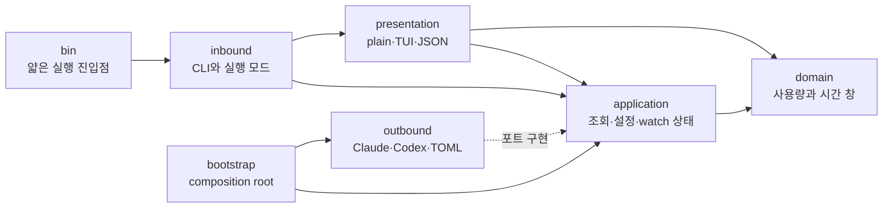
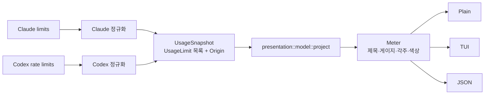
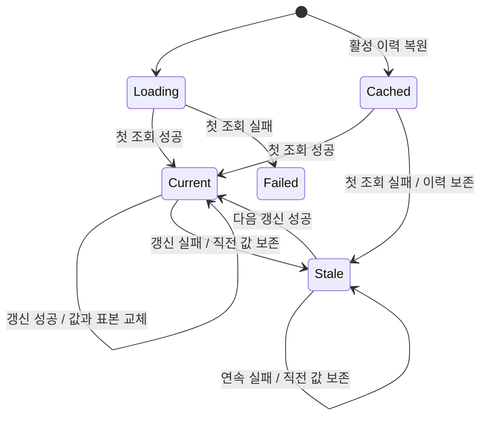
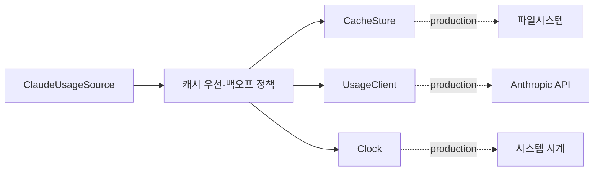
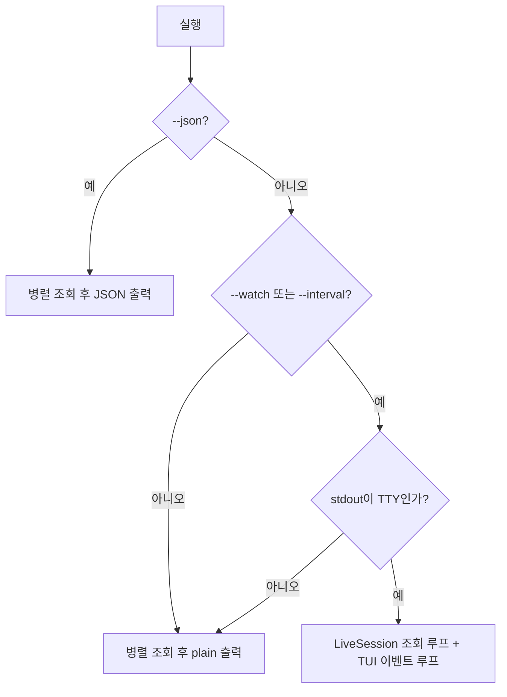
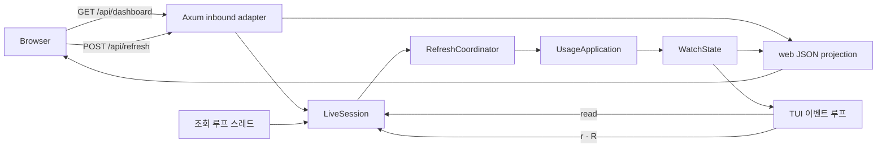

# 아키텍처

`agentmeter`는 하나의 실행 파일에서 설정 또는 `--agent`로 provider를 선택하며,
핵심 정책이 HTTP·프로세스·파일시스템·터미널 기술에 의존하지 않도록 헥사고날
아키텍처로 구성합니다.

## 의존성 방향

안쪽 계층은 바깥 계층을 모릅니다.

- `src/domain/` — `UsageLimit`, `UsageSnapshot`, `Origin`, `UsageWindow` 같은 순수 도메인 값
- `src/application/` — 공급자 선택·병렬 조회, 설정, watch 상태와 아웃바운드 포트
- `src/adapters/inbound/` — CLI 문법과 1회·JSON·TUI·로컬 웹 실행 모드
- `src/adapters/outbound/claude/` — Claude 캐시, 자격증명, HTTP 어댑터
- `src/adapters/outbound/codex/` — Codex app-server JSONL 어댑터
- `src/adapters/outbound/config.rs` — TOML 설정 저장소
- `src/adapters/outbound/history.rs` — SQLite 히스토리 저장소와 구형 JSON import
- `src/adapters/presentation/` — 화면 모델 투영, plain·TUI·JSON 출력
- `src/bootstrap.rs` — 구체 어댑터를 포트에 연결하는 유일한 composition root
- `src/bin/` — 공개 실행 함수 하나만 호출하는 얇은 프로세스 진입점

라이브러리 공개 표면은 `run_agentmeter` 하나로 제한합니다. 내부 포트와 어댑터를
외부 API로 노출하지 않아 계층 구조를 구현 세부사항으로 유지합니다.

## 도메인과 화면 모델 분리

공급자는 렌더링 문자열이나 색상을 만들지 않습니다. 각 공급자의 응답을 공통 도메인으로
정규화한 뒤 presentation 어댑터가 한 번만 화면 모델로 투영합니다.

`UsageLimit`은 다음 의미만 보관합니다.

- 공급자가 부여한 안정적인 `LimitId`
- 선택적인 모델 범위(scope)
- 소진율과 심각도
- 현재 적용 중인지 여부
- 창 길이와 리셋 시각

`Current week`, `N% used`, `Resets …`, `not started` 같은 문구와 색상은
`adapters/presentation/model.rs`에서 만듭니다. 시간대도 표현 관심사이므로 조회 포트에
전달하지 않습니다. 모든 투영 함수는 현재 시각을 인자로 받아 테스트가 결정론적입니다.

## 애플리케이션 경계

### 조회

`UsageApplication::query(names, policy)`가 다음 작업을 하나의 사용 사례로 제공합니다.

1. 요청한 공급자 이름을 검증합니다.
2. 설정 순서대로 공급자를 선택합니다.
3. 공급자를 병렬로 조회합니다.
4. 출력 어댑터에는 capability가 없는 `AgentInfo`와 결과만 반환합니다.

출력 계층은 `UsageSource` 구현이나 공급자 선택 방법을 알지 못합니다. `FetchPolicy`는
`PreferCached`와 `Fresh`만 표현하며, CLI의 `--live` 문법은 인바운드 어댑터에서 정책으로
변환합니다.

### 설정

`SettingsApplication`이 기본값 선택·유효성 검사·저장을 함께 책임집니다.
TOML 파싱과 파일 위치는 `FileSettingsRepository`가, `agents=claude,codex` 같은 명령행
문법은 인바운드 어댑터가 맡습니다. composition root는 설정 저장소를 포트 뒤에 넣고
애플리케이션에 주입합니다.

### 상주 상태

`LiveSession`이 상주 조회 하나를 소유합니다 — `WatchState`, refresh gate, 다음 조회
시각을 한 경계 안에 묶고, 화면은 그 상태를 읽고 요청만 보냅니다. 그래서 터미널과
브라우저를 함께 띄워도 provider 조회는 화면 수와 무관하게 한 번만 나갑니다.
조회를 언제 돌릴지(스레드 주기 / HTTP 요청)는 어댑터가 정하고, 세션은 무엇을 어떻게
합칠지만 정합니다.

`WatchState`가 이전 성공 값 보존, 최근 오류와 공급자별 상태를 관리합니다.
`HistoryRepository` 포트는 raw 저장 작업 대신 활성 창 복원과 snapshot 기록이라는 lifecycle을
제공합니다. SQLite schema, transaction, 구형 JSON 자동 import, 구형 ID 병합과 scope 복원을
아웃바운드 어댑터 안에 숨깁니다. 시작할 때 현재 시각을 포함하는 활성 창을 먼저 복원하므로
첫 원격 조회가 실패해도 저장된 값과 오류를 함께 표시합니다. 손상된 구형 JSON이 있어도
정상 데이터는 부분 복원하고 경고를 함께 표시합니다.

시계열은 화면 제목이 아니라 `LimitId`로 키를 잡습니다. 제목이나 번역이 바뀌어도 같은
한도의 표본이 끊기지 않습니다. 애플리케이션은 실제 측정 시각의 수치 표본만 저장하고,
3행 Sparkline과 `+3%p` 문구는 presentation의 `history` 모듈이 만듭니다. 공급자·창 길이·
시작·종료 시각이 포함된 유일한 파일을 사용하므로 재실행해도 같은 5시간/7일 창만 복원합니다.

## Claude 획득 정책의 내부 포트

Claude 어댑터 안에서도 정책과 기술을 분리합니다.

이 포트들은 Claude 어댑터 내부 전용입니다. 프로덕션에서는 파일·HTTP·시계를 연결하고,
테스트에서는 메모리 구현을 연결한 `ClaudeUsageSource`를 공개 `UsageSource` 포트로 호출합니다.
따라서 다음 정책을 홈 디렉터리나 네트워크 없이 검증합니다.

- 신선한 캐시는 HTTP를 호출하지 않습니다.
- 오래된 캐시 갱신이 실패하면 직전 캐시를 `refresh_failed` 상태로 반환합니다.
- `Fresh`는 캐시와 백오프를 건너뛰고 성공 시 백오프를 해제합니다.
- 실패 시 음수 캐시를 기록합니다.

## 실행 모드

네트워크 조회는 세션의 전용 스레드가 수행합니다. TUI 메인 스레드는 키 입력과 렌더링을
계속 처리하므로 원격 타임아웃 중에도 `q`, `r`, `R`에 반응합니다 — 키 입력은 조회를
직접 실행하지 않고 세션에 요청만 넣습니다. `RefreshCoordinator`가 TUI와 웹의 공통
refresh state machine을 소유합니다. 조회 중 들어온 요청은 하나로 합치고 `R`/Fresh
요청을 우선해 현재 조회 직후 한 번만 실행합니다. thread/channel과 Tokio task는 각
adapter에 남습니다. 출력이 파이프나 `watch` 아래라면 alternate screen을 사용할 수 없으므로
자동으로 1회 plain 출력으로 내려갑니다.

웹 모드는 `agentmeter web`이라는 별도 인바운드 인터페이스를 사용합니다. Axum 서버는
기본적으로 `127.0.0.1:0`에 바인딩하며 `--host`와 `--port`가 있으면 지정한 주소를
사용해 Tokio 런타임에서 HTTP를 처리합니다. 서버는 백그라운드 스레드에서 돌고 바인딩된
주소를 즉시 돌려주므로, 화면을 띄우기 전에 포트 충돌을 오류로 알 수 있습니다. 터미널을
화면으로 쓸 수 있으면 같은 세션을 보는 TUI를 함께 띄우고 접속 주소를 헤더에 표시합니다.
이때 서버는 stdout·stderr에 쓰지 않습니다 — alternate screen을 깨뜨리기 때문입니다.
기존 공급자 어댑터는 동기 I/O이므로 `spawn_blocking`으로 격리해 HTTP executor를 막지
않습니다. HTTP handler는 세션 상태를 읽어 presentation의 웹 projection 결과만 JSON으로
반환합니다. window 시작·종료, SVG area path와 시간 marker 좌표는 Rust projection이
계산하며 browser는 그리기와 server clock 기준 1초 countdown만 담당합니다.

HTML/CSS/JavaScript는 실행 파일에 포함하고 외부 CDN을 사용하지 않습니다. 브라우저는
JSON을 2초마다 읽어 bar chart와 SVG area chart를 갱신하며, 실제 provider 조회는
설정된 30초 이상의 주기로만 수행합니다.

## 새 공급자 추가

1. `src/adapters/outbound/<provider>/`에서 외부 응답을 파싱합니다.
2. 응답을 `UsageLimit` 목록으로 정규화합니다. 제목이나 색상은 만들지 않습니다.
3. `UsageSource`를 구현해 `UsageSnapshot`을 반환합니다.
4. `bootstrap.rs`에서 `RegisteredAgent`로 조립합니다.
5. CLI 선택이 필요하면 `agentmeter --agent <name>` 경로와 문서를 검증합니다.

설정 검증, 병렬 조회, stale 값 보존, plain·TUI·JSON 표현은 기존 경로를 그대로 재사용합니다.

## 관련 문서

- [아키텍처 리뷰](architecture-review.html)
- [Claude 조회 정책](claude-provider.md)
- [Codex app-server 연동](codex-provider.md)

## 후속 deepening 작업

- [#6 설정과 선택 workflow 통합](https://github.com/yoophi/agentmeter/issues/6)
- [#4 Claude 획득 정책 테스트 보강](https://github.com/yoophi/agentmeter/issues/4)
- [#3 LimitKind 도메인 모델 추가](https://github.com/yoophi/agentmeter/issues/3)
- [#2 ADR과 ubiquitous language 용어집 작성](https://github.com/yoophi/agentmeter/issues/2)
