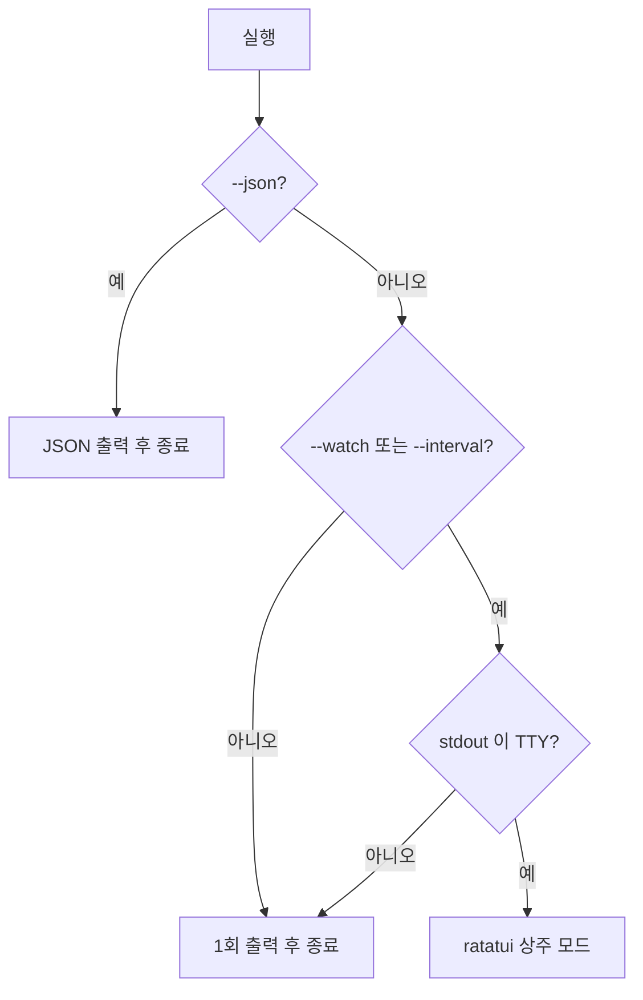
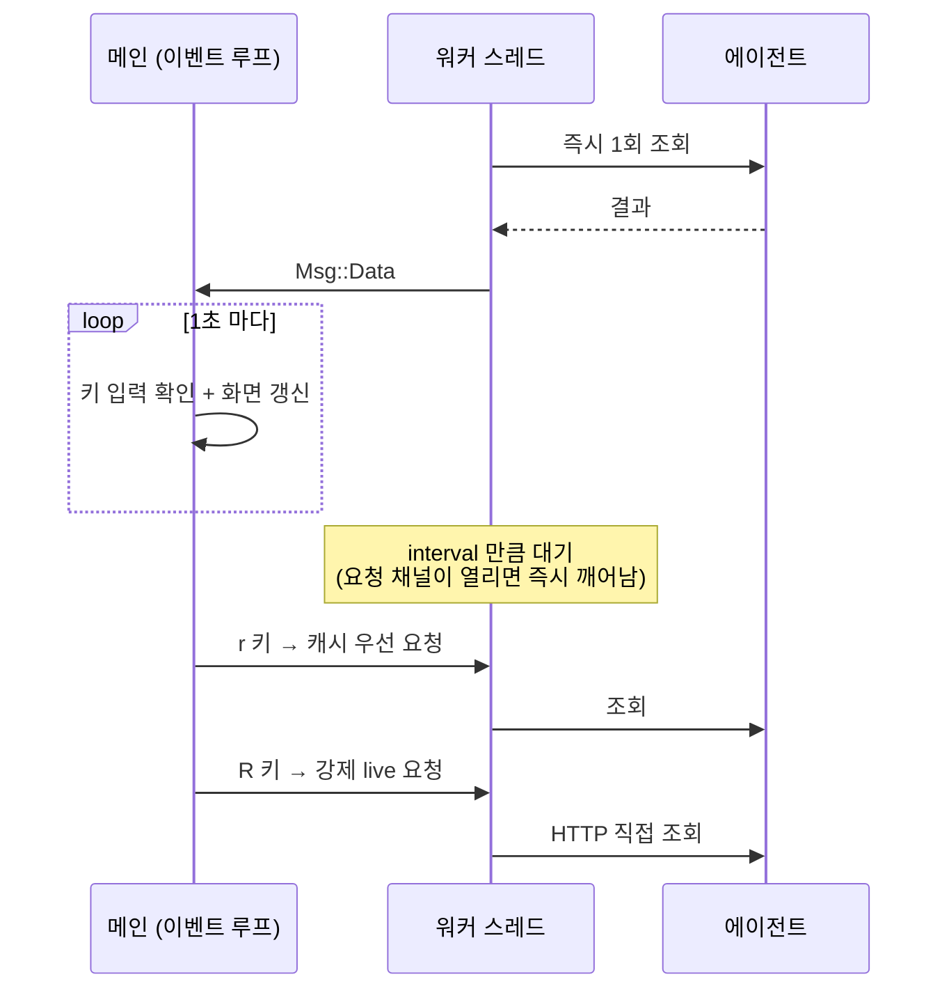

# 구조

`agentmeter` 는 두 개의 바이너리(`ccmeter`, `codexmeter`)를 담은 하나의 패키지입니다.
서로 다른 에이전트를 보지만 화면에 그리는 방식은 완전히 같아야 하므로,
**데이터를 가져오는 부분만 도구별로 두고 나머지는 전부 공유**합니다.

```
src/
  meter.rs        공통 화면 표현 + 문구 생성 + 창 진행률 계산
  history.rs      창별 사용률 영속 기록 + 텍스트 차트
  app.rs          실행 모드 분기
  cli.rs          공통 옵션
  render/
    mod.rs        색·JSON 출력
    plain.rs      stdout 렌더러
    tui.rs        ratatui 렌더러 + 이벤트 루프
  claude/         ccmeter 전용
    api.rs        /api/oauth/usage HTTP 클라이언트
    auth.rs       Keychain 자격증명 (읽기 전용)
    source.rs     캐시 우선 조회 + 실패 백오프
    model.rs      응답 → Meter
  codex/          codexmeter 전용
    client.rs     app-server JSONL 클라이언트
    source.rs     조회 진입점 (캐시 없음)
    model.rs      응답 → Meter
  bin/
    ccmeter.rs    진입점
    codexmeter.rs 진입점
```

## 공통 표현: `Meter`

각 에이전트의 응답은 서로 다르지만, 화면에 그릴 때 필요한 것은 같습니다.
그래서 응답을 곧바로 `Meter` 목록으로 옮기고, 그 뒤로는 출처를 구분하지 않습니다.

```rust
pub struct Bar {
    pub fill: f64,      // 채움 비율 0.0 ~ 1.0
    pub label: String,  // "50% used" / "1 hour 12 minutes left"
    pub level: Level,   // 색 (Normal / Warning / Critical)
}

pub struct Meter {
    pub title: String,            // "Current week (all models)"
    pub usage: Bar,               // 한도를 얼마나 썼는지
    pub time: Option<Bar>,        // 창의 시간이 얼마나 흘렀는지
    pub footnote: Option<String>, // "Resets Aug 20 at 12:31pm (Asia/Seoul)"
    pub emphasized: bool,         // 지금 적용 중인 한도 → `›` 마커
}
```

`fill` 과 `label` 을 나눠 둔 이유가 있습니다.
Codex 의 `/status` 는 남은 비율(`71% left`)로 표시하고 Claude 의 `/usage` 는
소진율(`51% used`)로 표시하는데, 퍼센트 하나로 합쳐 두면 어느 쪽 기준인지
호출부마다 헷갈립니다. 채움 비율과 표시 문구를 분리하면 각 도구가 자기 방식대로
채워 넣을 수 있고, 렌더러는 해석 없이 그리기만 하면 됩니다.

> 현재는 두 도구 모두 **소진율(`N% used`)** 로 통일해 두었습니다.
> Codex 원본은 남은 비율이므로 `100 - usedPercent` 가 아니라 `usedPercent` 를 그대로 씁니다.

### 두 번째 게이지: 창 진행률

`time` 은 한도 창(window)의 시간이 얼마나 흘렀는지를 보여줍니다.
사용률과 나란히 놓으면 페이스가 읽힙니다:

```
  Current session
  ██████████████████████████████████░░░░░░░░░░░░░░  71% used
  ██████████████████████████████████████████████░░  0 hour 15 minutes left
```

시간은 95% 지났는데 71% 만 썼으므로 이번 창은 여유가 있습니다.
반대로 시간 게이지가 사용량보다 짧으면 이번 창은 일찍 소진됩니다.

창 길이를 어디서 얻는지는 도구마다 다릅니다.

| | 창 길이 출처 |
|---|---|
| ccmeter | 응답에 없어 `kind` 로 유추 — `session`→5시간, `weekly*`→7일 |
| codexmeter | 응답의 `windowDurationMins` 를 그대로 사용 |

모르는 종류가 오면 시간 게이지를 만들지 않습니다. 잘못된 창 길이로 그리는 것보다
안 그리는 편이 낫습니다.

`time_bar()` 는 현재 시각을 **인자로 받습니다.** 내부에서 시계를 읽으면 호출 시점이
조금만 달라져도 분이 내림되어 결과가 흔들리고, 테스트도 결정론적으로 쓸 수 없습니다.
한 화면의 모든 항목은 같은 기준 시각을 씁니다.

## 문구는 한곳에서 만듭니다

두 도구의 출력이 눈으로 봐서 같아야 하므로, 제목과 각주 문구는 `meter.rs` 에 모았습니다.

- `resets_text(at, tz)` → `Resets Aug 20 at 12:31pm (Asia/Seoul)`
  오늘이든 아니든 **항상 날짜를 붙입니다.** 시각만 있으면 화면만 보고
  오늘인지 내일인지 알 수 없습니다.
- `window_title(duration_mins, scope)` → `Current week (all models)`
  창 길이(분)로 `Current session` / `Current day` / `Current week` / `Current month` 를 고릅니다.
- `time_left_label(remaining, with_days)` → `2 day 3 hour 15 minutes left`
  단위를 단수로 고정합니다. 자릿수가 일정해야 여러 줄이 세로로 맞습니다.

## 실행 모드



핵심은 **TTY 감지**입니다. ratatui 는 alternate screen 과 raw mode 를 쓰기 때문에
`watch` 아래나 파이프에서는 동작할 수 없습니다. 그런 상황에서는 상주 모드를
요청받았더라도 조용히 1회 출력으로 내려갑니다. 덕분에 `watch -n 60 ccmeter` 가
그대로 동작합니다.

### 실패도 stdout 으로

조회에 실패해도 오류 문구를 **stdout** 에 씁니다. `watch` 는 stdout 만 캡처하므로
stderr 로 보내면 오류가 났을 때 화면이 빈 채로 남아, 멈춘 것인지 실패한 것인지
구분할 수 없습니다. 종료 코드는 실패(`1`)로 돌려줍니다.

## 상주 모드

네트워크 조회는 **워커 스레드**가 담당합니다. 메인 스레드에서 직접 부르면
타임아웃(최대 15~20초) 동안 화면이 얼어붙고 `q` 조차 먹지 않습니다.



조회가 실패해도 **직전 데이터를 지우지 않습니다.** 화면이 비는 것보다
낡은 값이라도 남기고 푸터에 `갱신 실패` 와 실제 오류 사유를 띄우는 편이 낫습니다.

화면을 다시 그리는 주기(1초)는 키 반응성과 무관합니다. `event::poll` 은 키가 들어오면
즉시 깨어나고, 이 값은 유휴 상태에서 `다음 N초` 카운트다운을 흘리는 간격일 뿐입니다.

## 시계열 차트 (상주 모드)

상주 모드는 조회할 때마다 각 한도의 사용률을 실제 측정 시각 기준의 분 단위로 기록하고,
Ratatui 내장 `Sparkline` 을 이용한 3행 차트로 보여줍니다.

```
 › Current session  +3%p
   ██████████████████████████░░░░░░░░  62% used
   ████████████████████████████████░░  0 hour 24 minutes left
   ···································
   ·····························▅▅▆··   ← 시계열 차트
   ······························███··
   Resets Aug 18 at 9:30pm (Asia/Seoul)
```

**가로축은 창 전체**입니다(세션 5시간 / 주간 7일). 바로 위 시간 게이지와 같은 축이라
세로로 맞춰 읽힙니다 — 차트의 표본이 어느 지점에 찍혔는지가 곧 그 창의 어느 시점인지입니다.
아직 수집하지 못한 구간은 표본이 없으므로 `·` 로 비워 둡니다.

**세로축은 0~100% 고정**입니다. `Sparkline::max(100)`으로 고정하고,
측정하지 않은 칸은 `Option<u64>::None`과 `absent_value_symbol("·")`로 구분합니다.
창 전체를 보는 맥락에서는 절대값이 맞습니다.
표본이 두 개 미만이면 변화를 임의로 그리지 않고 모든 칸이 `None`인 placeholder 를 렌더링합니다.

제목 옆 `+3%p` 는 현재 창에 저장된 첫 표본 이후 늘어난 양입니다. 차트 옆에 붙이면
폭이 밀려 게이지와 축이 어긋나므로 제목 줄에 둡니다. 변화가 없으면 표시하지 않습니다.
변화량도 현재 `Window` 안의 표본만 사용하므로, 리셋 전 사용률과 새 창의 사용률을
빼서 큰 음수로 표시하지 않습니다.

기록은 `~/.cache/agentmeter/history/` 아래에 한도 창별로 저장합니다.
윈도우 키는 `길이(분) + 분 단위 리셋 시각`이며, 파일명은
`claude__5H__YYYYMMDDHHMMSS__YYYYMMDDHHMMSS.json` 또는
`codex__7D__YYYYMMDDHHMMSS__YYYYMMDDHHMMSS.json` 형태입니다.
시작·종료 시각은 사용자의 로컬 시간대를 사용합니다.
같은 7일 창에 속한 all-models와 모델별 시리즈는 한 파일 안에서 제목으로 분리됩니다.

재실행 후 첫 조회에서 같은 키의 파일을 먼저 복원하고 새 표본을 추가합니다. 리셋
시각이 바뀌면 새 파일을 사용하므로 이전 창의 표본이 차트나 변화량에 섞이지 않습니다.
파일은 임시 파일을 쓴 뒤 교체해 중간 상태를 읽지 않게 합니다.

같은 분에 여러 번 조회하면 한 칸으로 합치고 마지막 값을 남깁니다 —
한 칸은 "그 분이 끝났을 때의 상태" 를 뜻합니다.

창이 리셋되면 표본이 새 창의 앞쪽부터 다시 찍힙니다. 창 밖(이전 창)의 표본은
그리지 않습니다.

## 값의 출처와 신선도

`Snapshot` 은 `Meter` 목록과 함께 **언제 어디서 가져왔는지**(`Origin`)를 담습니다.
ccmeter 는 로컬 캐시를 읽을 수 있어서, 화면의 숫자가 방금 조회한 값인지
몇 분 전 캐시인지 구분되어야 하기 때문입니다.

Claude Code 캐시가 갱신되지 않는 경우를 대비해, 성공한 직접 조회는 agentmeter 전용
캐시에도 보존하고 두 캐시 중 더 최신인 값을 선택합니다.

```
  기준 21:12 (2분 전, 로컬 캐시)
  기준 21:13 (방금, 직접 조회)
  기준 20:41 (34분 전, 로컬 캐시 · 갱신 실패)
```

마지막 형태는 갱신을 시도했지만 실패해 낡은 값을 보여주는 중이라는 뜻입니다.
자세한 조회 전략은 [ccmeter.md](ccmeter.md) 를 보세요.

## 갱신 주기

원격 조회이므로 최소 30초로 자릅니다(기본 60초). 더 짧게 요청하면 값을 올리고
그 사실을 알립니다. 데이터 자체가 그보다 자주 변하지 않고,
`ccmeter` 쪽은 자주 부르면 실제로 `HTTP 429` 를 받습니다.

## 새 에이전트 추가하기

1. `src/<이름>/` 에 클라이언트와 응답 모델을 넣고 `to_meters()` 를,
   그리고 `Snapshot` 을 돌려주는 `source::fetch(tz)` 를 만듭니다.
2. `src/bin/<이름>meter.rs` 에 진입점을 둡니다.

```rust
fn main() -> ExitCode {
    app::main("<이름>meter", "... 사용 한도를 한눈에 보여줍니다", make_fetch)
}

fn make_fetch(tz: String, live: bool) -> Fetch {
    Box::new(move |_force_live| <이름>::source::fetch(&tz))
}
```

`tz` 는 `app` 이 프로세스당 한 번 해석해 넘겨줍니다. 시간대 해석은 OS 호출이라
조회할 때마다 다시 하면 낭비입니다.

3. `Cargo.toml` 에 `[[bin]]` 항목을 추가합니다.

게이지, TUI, CLI 옵션, JSON 출력, 오류 처리는 손댈 필요가 없습니다.
