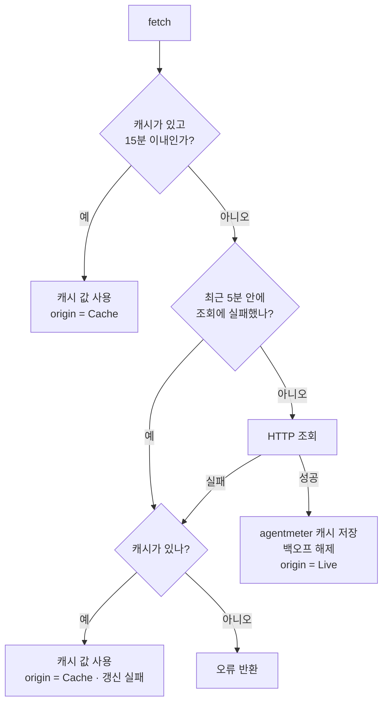

# ccmeter 내부 동작

Claude Code 의 `/usage` 가 보여주는 값을 그대로 가져옵니다.

## 값의 출처

한도 값을 얻는 경로는 네 가지가 있고, 그중 두 종류(캐시와 직접 조회)를 씁니다.

| 경로 | 내용 | 채택 |
|---|---|---|
| `~/.claude/token-scope-oauth-usage.json` | Claude Code 가 캐시해 둔 응답 | **1차** |
| `~/.cache/agentmeter/claude-usage.json` | 마지막 직접 조회 성공 응답 | **1차** |
| `GET /api/oauth/usage` | 직접 조회 | 캐시가 낡았을 때만 |
| `anthropic-ratelimit-unified-*` 응답 헤더 | 추론 요청의 응답에 실려 옴 | ✗ 쓸 수 없음 |
| `~/.claude/projects/**/*.jsonl` 집계 | 로컬 대화 기록 | ✗ 부정확 |

### 응답 헤더를 쓸 수 없는 이유

Claude Code 바이너리에는 이런 헤더 이름들이 들어 있습니다:

```
anthropic-ratelimit-unified-5h-utilization
anthropic-ratelimit-unified-5h-reset
anthropic-ratelimit-unified-7d-utilization
anthropic-ratelimit-unified-7d-reset
```

Claude Code 는 평소 추론 요청(`/v1/messages`)의 **응답 헤더**로 한도를 공짜로
추적합니다. 하지만 이 도구가 그 헤더를 받으려면 추론 요청을 보내야 하고,
그건 사용량을 조회하려고 사용량을 쓰는 셈입니다.

### 로컬 대화 기록을 쓰지 않는 이유

`~/.claude/projects/**/*.jsonl` 에는 요청별 토큰 수가 남아 있지만,

1. **그 기기의 기록만** 있습니다. 한도는 계정 단위로 합산되므로 다른 컴퓨터나
   웹에서 쓴 양이 빠져 항상 실제보다 낮게 나옵니다.
2. **한도 산정 공식이 비공개**입니다. `cache_read_input_tokens` 같은 값이 있어도
   그게 5시간 한도의 몇 %인지 환산할 수 없습니다.
3. 세션 롤링 창의 경계도 추정이어야 합니다.

## 조회 전략



백오프 중이든 조회에 실패했든 마지막 처리는 같습니다 — 코드에서도 두 경우가
`or_else` 한 곳으로 합류합니다.

- `MAX_AGE` = 15분. 세션 창은 5시간, 주간 창은 7일이라 몇 분 차이는 화면에 드러나지 않습니다.
- `NEG_TTL` = 5분. 실패 후 이만큼은 다시 두드리지 않습니다.
- `--live` 는 캐시를 건너뛰고 항상 직접 조회합니다.

### 캐시 파일

```json
{
  "captured_at": "2026-08-18T11:54:53.330Z",
  "plan_name": "Pro",
  "usage": { "limits": [ ... ] }
}
```

`usage` 안에 `/api/oauth/usage` 응답이 들어 있어, 직접 조회와 같은
타입(`UsageResponse`)으로 파싱합니다. 두 캐시 중 `captured_at` 이 최신인 값을
고르므로 얼마나 낡았는지 정확히 알 수 있습니다.

**이 파일의 갱신은 우리가 유도할 수 없습니다.** `claude -p "..."` 로 추론 요청을
보내도 파일은 그대로였습니다(실측). Claude Code 가 자체 판단으로 갱신합니다.
그래서 낡았을 때 직접 조회 말고는 방법이 없습니다. 직접 조회에 성공하면 ccmeter 는
필요한 정규화 값(`limits`)을 agentmeter 전용 캐시에 원자적으로 저장합니다. 이후
요청이 429 를 받아도 Claude Code 의 더 오래된 캐시로 회귀하지 않습니다.

### 실패 백오프

`watch` 처럼 프로세스가 매번 새로 뜨는 경우에도 유지되어야 하므로, 메모리가 아니라
`~/.cache/agentmeter/claude-usage.err` 파일의 **수정 시각**으로 기록합니다.

재인증 오류(`401`/`403`)에는 백오프를 걸지 않습니다. 사용자가 로그인하면
즉시 반영되어야 하기 때문입니다.

## 응답 형태

`limits` 배열만 읽습니다. 응답 최상위에는 이런 필드들이 함께 오지만 쓰지 않습니다:

```
five_hour, seven_day, seven_day_opus, seven_day_sonnet, seven_day_cowork,
seven_day_oauth_apps, seven_day_omelette, omelette_promotional,
tangelo, iguana_necktie, nimbus_quill, cinder_cove, amber_ladder
```

대부분 `null` 이고 계정 종류에 따라 켜졌다 꺼지며, 이름도 임의의 코드네임입니다.
여기에 의존하면 계정이나 배포가 바뀔 때 바로 깨집니다.

반면 `limits` 는 서버가 화면용으로 정규화해 둔 배열입니다:

```json
{
  "kind": "weekly_scoped",
  "group": "weekly",
  "percent": 75,
  "severity": "warning",
  "resets_at": "2026-08-18T15:59:59.829940+00:00",
  "scope": {"model": {"display_name": "Fable", "id": null}},
  "is_active": true
}
```

| 필드 | 쓰임 |
|---|---|
| `kind` | 제목 (`session` → `Current session`) 과 창 길이 유추 |
| `percent` | 사용량 게이지와 `N% used` |
| `severity` | 게이지 색. `normal` / `warning` / `critical` 관측됨 |
| `resets_at` | 각주와 시간 게이지 계산 |
| `scope.model.display_name` | 제목의 괄호 안 (`Current week (Fable)`) |
| `is_active` | `›` 마커 |

처음 보는 `kind` 가 와도 죽지 않습니다. `monthly_burst` 라면
`monthly burst` 로 표시하고, 창 길이를 모르니 시간 게이지만 생략합니다.
`severity` 도 모르는 값이면 사용률로 등급을 정합니다.

## 자격증명

macOS 는 Keychain(`Claude Code-credentials`), 그 외에는
`~/.claude/.credentials.json` 에서 `claudeAiOauth.accessToken` 을 **읽기만** 합니다.

**토큰 갱신은 하지 않습니다.** 리프레시 토큰은 회전(rotation)하므로 이 도구가
갱신해 저장하면 Claude Code 본체의 세션을 무효화할 수 있고, 반대도 마찬가지입니다.
대신 매 조회마다 자격증명을 다시 읽어, Claude Code 가 갱신해 둔 새 토큰을
자연스럽게 따라갑니다. 액세스 토큰 수명은 관측상 몇 시간, 리프레시 토큰은 약 9일이라
상주 모드는 반드시 만료를 만납니다 — 그때는 `claude` 를 한 번 실행하면 됩니다.

## HTTP 429

이 엔드포인트는 사람이 `/usage` 를 가끔 누르는 빈도를 전제로 합니다.
자주 부르면 막힙니다.

```
HTTP/2 429
retry-after: 0
{"error":{"type":"rate_limit_error","message":"Rate limited. Please try again later."}}
```

`Retry-After` 를 주기는 하지만 값이 `0` 이고, 실제로는 그 뒤로도 한동안 막힙니다.
그래서 **0 은 "값 없음"으로 취급**합니다 — 그대로 쓰면 "0초 후 다시 시도"라는
틀린 안내가 됩니다. 양수일 때만 그 값을 안내합니다.

`User-Agent` 와는 무관합니다. `ccmeter/0.1.0` 과 `claude-cli/2.1.234` 로 각각
보내 봤지만 둘 다 429 였습니다.

429 를 만나도 캐시 우선 전략 덕분에 화면은 정상으로 나옵니다.
`Retry-After` 헤더를 읽으려면 4xx 를 오류가 아닌 응답으로 받아야 해서,
ureq 에 `http_status_as_error(false)` 를 설정했습니다.
