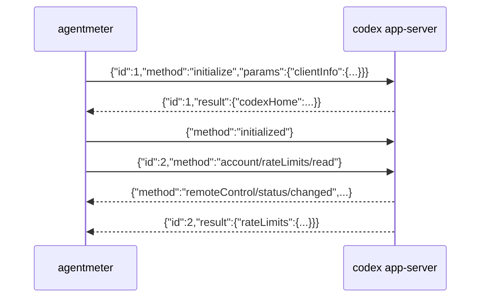

# Codex provider app-server 연동

Codex 의 `/status` 가 보여주는 한도 값을 가져옵니다.

## 왜 app-server 인가

Codex 한도를 얻는 경로는 두 가지입니다.

| 경로 | 방식 | 채택 |
|---|---|---|
| `codex app-server` 의 `account/rateLimits/read` | 자식 프로세스와 JSONL 주고받기 | **채택** |
| `GET https://chatgpt.com/backend-api/wham/usage` | 토큰을 직접 읽어 HTTP 호출 | ✗ |

HTTP 쪽이 더 빠릅니다(~0.3초 대 ~1초). 그럼에도 app-server 를 쓰는 이유:

- **토큰을 만질 일이 없습니다.** HTTP 로 가려면 `~/.codex/auth.json` 에서
  `tokens.access_token` 과 `tokens.account_id` 를 직접 읽고 `ChatGPT-Account-Id`
  헤더까지 붙여야 합니다. 갱신·만료도 직접 감당해야 합니다.
- **응답 타입을 Codex 가 직접 알려줍니다.** 추측한 필드가 하나도 없습니다.

```bash
codex app-server generate-json-schema --out ./schema
# GetAccountRateLimitsResponse, RateLimitSnapshot, RateLimitWindow, ...
```

Codex 는 이 인터페이스를 `[experimental]` 로 표시하고 있어 바뀔 수 있습니다.
그때는 위 명령으로 새 스키마를 받아 대조하면 됩니다.

## 프로토콜

줄 단위 JSON 이고 `jsonrpc` 필드는 없습니다. 세 줄을 보내고 응답을 기다립니다.



- `initialize` 의 `clientInfo.name`·`version` 은 필수입니다.
- `initialized` 는 알림이라 `id` 가 없습니다.
- `account/rateLimits/read` 는 파라미터가 없습니다.
- **알림이 사이사이 끼어듭니다.** 위의 `remoteControl/status/changed` 처럼요.
  그래서 응답은 `id == 2` 인 줄만 골라냅니다.

읽기는 별도 스레드가 맡고 메인은 마감 시각까지만 기다립니다. 응답이 오지 않을 때
영원히 매달리지 않기 위해서입니다(타임아웃 20초). 성공하든 실패하든 자식
프로세스는 종료시킵니다.

`CODEX_BIN` 으로 실행 파일 경로를 바꿀 수 있습니다.

## 응답 형태

```json
{
  "rateLimits": {
    "limitId": "codex", "limitName": null,
    "primary": {"usedPercent": 50, "windowDurationMins": 10080, "resetsAt": 1787196678},
    "secondary": null, "planType": "pro"
  },
  "rateLimitsByLimitId": {
    "codex": { ... 위와 동일 ... },
    "codex_bengalfox": {
      "limitId": "codex_bengalfox", "limitName": "GPT-5.3-Codex-Spark",
      "primary": {"usedPercent": 0, "windowDurationMins": 300, "resetsAt": 1787694267},
      "secondary": {"usedPercent": 0, "windowDurationMins": 10080, "resetsAt": 1788281067}
    }
  }
}
```

### 다중 뷰를 우선한다

`rateLimits` 는 하위호환용 단일 뷰이고, `rateLimitsByLimitId` 에 같은 값이
`codex` 키로 다시 들어 있습니다. **둘 다 쓰면 기본 한도가 두 번 나옵니다.**
다중 뷰가 있으면 그쪽만 쓰고, 없을 때만 단일 뷰로 내려갑니다.

### 순서를 고정한다

`rateLimitsByLimitId` 는 맵이라 정렬하지 않으면 실행할 때마다 줄 순서가 바뀝니다.
이름 없는 기본 한도를 먼저, 나머지를 이름순으로 놓습니다.

### 5시간·주간 창을 모두 보여준다

Codex CLI 0.149.1에서 `GPT-5.3-Codex-Spark`의 `primary`에 300분 창,
`secondary`에 10080분 창이 함께 관측됩니다. 300분 창과 하루보다 긴 창을 표시하고,
짧은 창부터 정렬합니다. 그 외 짧은 창이나 창 길이가 없는 항목은 제외합니다.

응답에서 300분 bucket 자체가 빠지면 `0% used`·`not started`인 `Current session`
placeholder를 표시합니다. named snapshot의 주간 창이 남아 있으면 같은 `limitId`와
`limitName`을 사용하므로 행의 제목과 히스토리 ID가 바뀌지 않습니다. 이때는 알 수 없는
reset 시각을 추측하지 않습니다. 실제 300분 창이 다시 반환되면 placeholder 대신 해당
사용량과 reset 시각을 사용합니다.

새 창이 추가되면 기존 창이 `primary`에서 `secondary`로 이동할 수 있습니다. 히스토리
ID는 이 위치를 쓰지 않고 `limitId + windowDurationMins`로 만들며, 예전 slot 기반 ID는
SQLite에서 읽을 때 새 ID로 자동 병합합니다.

### provider 간 표기를 맞춘다

Codex 의 `/status` 는 남은 비율로 보여줍니다:

```
Weekly limit:                     [    ] 71% left (resets 12:31 on 20 Aug)
GPT-5.3-Codex-Spark Weekly limit: [    ] 100% left (resets 18:37 on 25 Aug)
```

agentmeter는 provider 간 표기를 통일하기 위해 **소진율**로 바꿔 보여줍니다.
원본이 `usedPercent` 이므로 `100 - x` 변환이 아니라 그 값을 그대로 씁니다.

```
  Current session (GPT-5.3-Codex-Spark)
  ░░░░░░░░░░░░░░░░░░░░░░░░░░░░░░░░░░░░░░░░░░░░░░░░  0% used
  ░░░░░░░░░░░░░░░░░░░░░░░░░░░░░░░░░░░░░░░░░░░░░░░░  5 hour 0 minutes left
  Resets Aug 26 at 6:44am (Asia/Seoul)

  Current week (all models)
  ████████████████████████░░░░░░░░░░░░░░░░░░░░░░░░  50% used
  █████████████████████████████████████░░░░░░░░░░░  1 day 15 hour 17 minutes left
  Resets Aug 20 at 12:31pm (Asia/Seoul)
```

제목은 `windowDurationMins` 로 만들고(`10080` → `Current week`),
`limitName` 이 있으면 괄호에 넣습니다. 이름이 없으면 `(all models)` 입니다.

`resetsAt` 은 epoch 초입니다. 위 응답의 `1787196678` 은 `12:31 on 20 Aug` 로,
`/status` 화면과 일치합니다.

## 캐시가 없는 이유

`account/rateLimits/read` 는 호출 제한이 없고 app-server 가 값을 들고 있어
매번 직접 조회해도 무리가 없습니다. 그래서 Claude provider와 달리 캐시 계층이 없고,
`Origin` 은 항상 `Live` 입니다. `--live` 는 무시됩니다.

## 참고: 관측된 코드네임

`limitId` 에 `codex_bengalfox` 같은 코드네임이 옵니다. 이건 내부 식별자이고,
화면에 쓰는 이름은 `limitName`(`GPT-5.3-Codex-Spark`) 입니다.
`limitId` 는 정렬 시 동점 처리에만 씁니다.
